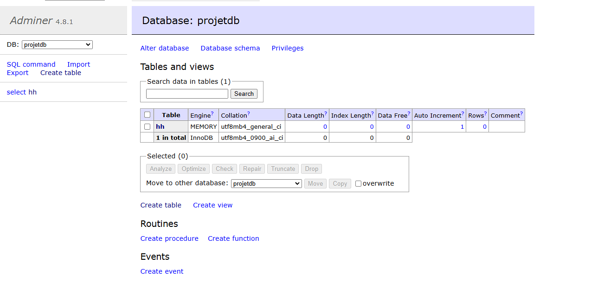

# Docker Multi-Container Application

A complete Docker Compose setup demonstrating a multi-service architecture with MySQL, Node.js backend, Nginx frontend, and Adminer for database management.

## Table of Contents
- [Services Overview](#services-overview)
- [Architecture Diagram](#architecture-diagram)
- [Installation Guide](#installation-guide)
- [API Documentation](#api-documentation)
- [Database Access](#database-access)
- [Troubleshooting Guide](#troubleshooting-guide)
- [Screenshots](#screenshots)

## Services Overview

### Database (MySQL)
- **Image**: `mysql:8.0`
- **Port**: `3306`
- **Environment Variables**:
  - `MYSQL_ROOT_PASSWORD`: root
  - `MYSQL_DATABASE`: projetdb
- **Volume**: Persistent storage for database files

### Backend (Node.js)
- **Base Image**: `node:16-alpine`
- **Port**: `3000`
- **Dependencies**:
  - Express.js
  - MySQL2
  - CORS
- **API Endpoints**:
  - `GET /`: Returns welcome message
  - `GET /api/status`: Checks database connectivity

### Frontend (Nginx)
- **Image**: `nginx:alpine`
- **Port**: `8080` (mapped to container port `80`)
- **Features**:
  - Static file serving
  - Reverse proxy for API requests

### Adminer
- **Image**: `adminer:latest`
- **Port**: `8081`
- **Function**: Web-based database management interface

## Architecture Diagram


## Installation Guide

1. **Clone Repository**
   ```
   git clone https://github.com/your-repo/docker-6.git
   cd docker-6
   ```

2. **Build and Start Containers**
   ```
   docker-compose up --build -d
   ```

3. **Verify Services**
   ```
   docker-compose ps
   ```

## API Documentation

### Check Database Status
- **Endpoint**: `GET /api/status`
- **Response Example**:
  ```json
  {
    "db_status": "connected",
    "current_time": "2025-02-14T10:00:00.000Z"
  }
  ```

## Database Access

### Via Adminer
1. Access http://localhost:8081
2. Use credentials:
   - System: MySQL
   - Server: database
   - Username: root
   - Password: root

### Command Line Access
```
docker exec -it db mysql -u root -proot
```

## Troubleshooting Guide

| Common Issues | Solutions |
|---------------|-----------|
| Connection refused errors | Check container status with `docker-compose ps` |
| Database initialization failures | Remove volumes with `docker-compose down -v` |
| Frontend not updating | Clear browser cache or use incognito mode |
| API timeout issues | Verify network connectivity between containers |

### Log Inspection:
```
# Backend logs
docker-compose logs backend

# Database logs
docker-compose logs database
```

> 📌 **Note**: This project requires Docker Desktop running in Linux container mode.

## Screenshots

API Response Test


Backend Logs


Network Configuration


Database



Create Tables

